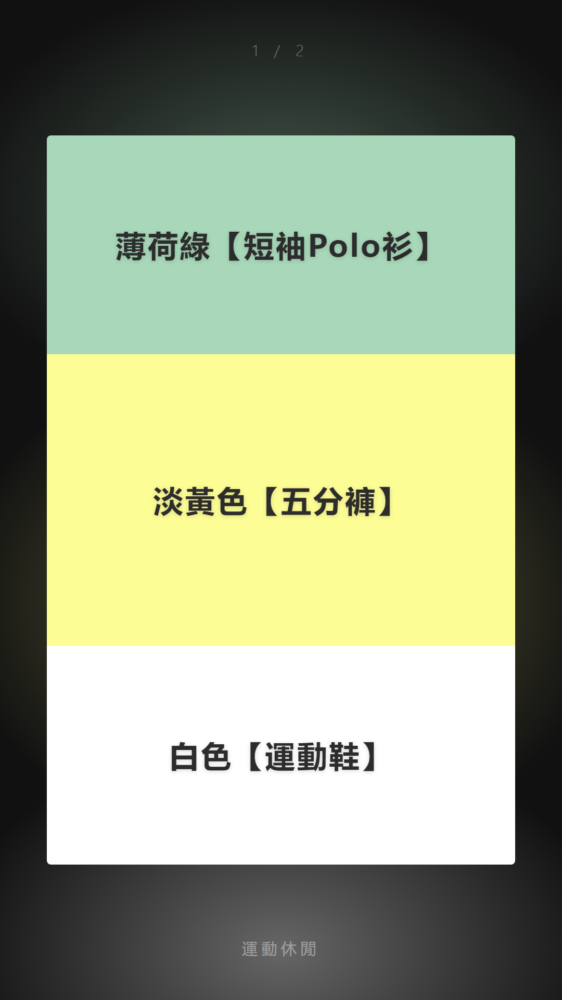
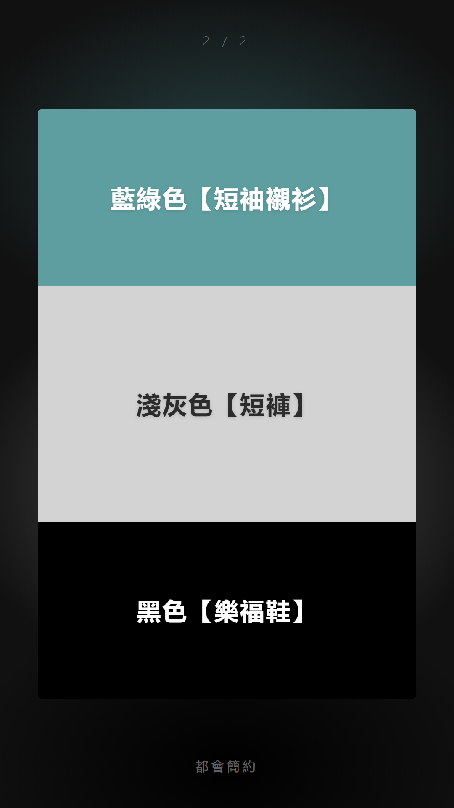
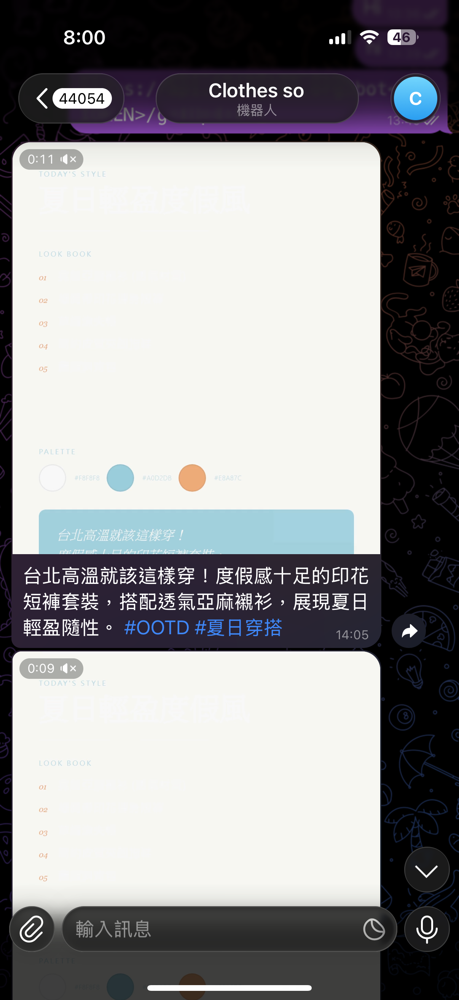
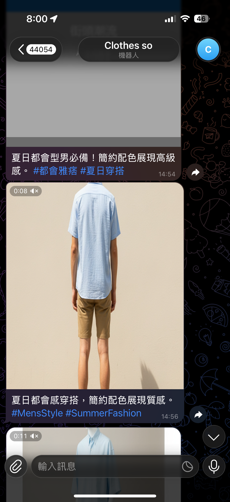
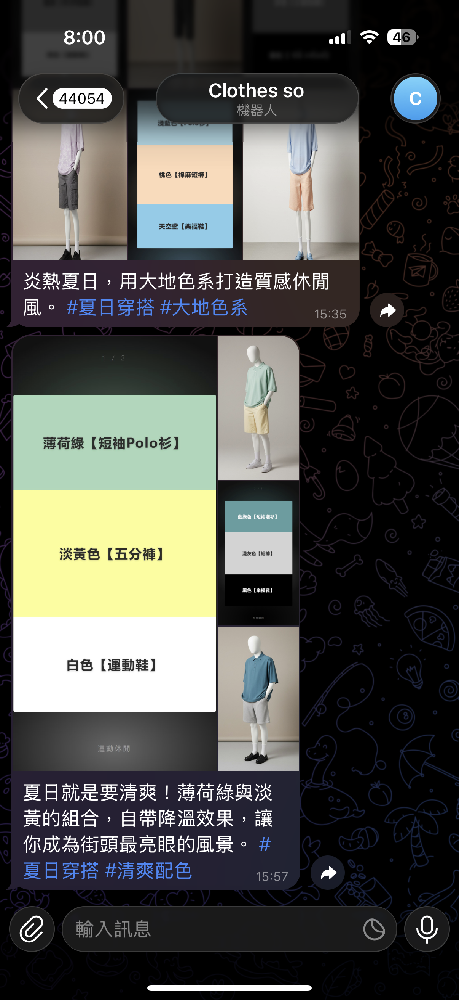

# clothes AI

[](https://github.com/perry121108-dotcom/clothes-AI/actions/workflows/ci.yml)

`clothes AI` is an AI automation workflow that generates daily outfit content, renders visual assets, and delivers the result through Telegram.

目前主展示方向為「每日穿搭圖片生成 + Telegram 自動交付」，並保留早期短影音生成成果作為功能演進證據。

## Project Positioning

This project is not just a single image generation script. It demonstrates an end-to-end automation workflow:

1. Read weather, trend, and seasonal conditions.
2. Generate outfit combinations with AI.
3. Render outfit cards and AI model images.
4. Deliver the result through Telegram.

## Product Direction

The project originally explored short-video generation. Because video API costs were higher and less predictable, the main portfolio path was repositioned into a sustainable image-first workflow.

This shows a product decision: preserve video output as evidence of experimentation, but focus the live demo on a repeatable and lower-cost automation loop.

## Showcase

### Outfit Cards





### AI Outfit Images


### Telegram Delivery







## Evidence

Generated portfolio assets:

```text
assets/github/generated/outfit-card-1.png
assets/github/generated/outfit-card-2.png
assets/github/generated/outfit-photo-1.png
assets/github/generated/outfit-photo-2.png
assets/github/telegram/telegram-delivery-1.png
assets/github/telegram/telegram-delivery-2.png
assets/github/telegram/telegram-delivery-3.png
assets/github/video/sample-short-video.mp4
```

Raw daily outputs are preserved in:

```text
output/
```

## Tech Stack

- Python
- Playwright
- Google Gemini API
- OpenWeatherMap API
- Telegram Bot API
- Jinja2
- pytest
- GitHub Actions

## Core Features

- Generate outfit content from weather and prompt inputs.
- Render outfit color cards.
- Generate AI outfit images.
- Deliver results to Telegram.
- Prevent duplicate same-day output.
- Keep generated outputs for portfolio review and QA.

## Project Structure

```text
clothes AI/
├─ main.py
├─ requirements.txt
├─ .env.example
├─ output/
├─ assets/
│  ├─ templates/
│  └─ github/
│     ├─ generated/
│     ├─ telegram/
│     └─ video/
├─ src/
│  ├─ data_layer/
│  ├─ brain_layer/
│  ├─ render_layer/
│  └─ delivery_layer/
└─ tests/
```

## Setup

```bash
pip install -r requirements.txt
playwright install chromium
```

Create `.env` from `.env.example` and fill in the required API keys:

```text
GEMINI_API_KEY=
OPENWEATHER_API_KEY=
DEFAULT_CITY=
TELEGRAM_BOT_TOKEN=
TELEGRAM_CHAT_ID=
```

## Run

```bash
python main.py
```

## Test

```bash
python -m pytest --tb=short -q
```

Verified result:

```text
65 passed
```

## Automation Schedule

This workflow can run daily through:

- local cron
- cloud VM cron
- GitHub Actions schedule

GitHub Actions schedule example:

```yaml
name: Daily Outfit Automation

on:
  schedule:
    - cron: "0 0 * * *"
  workflow_dispatch:

jobs:
  daily-outfit:
    runs-on: ubuntu-latest
    steps:
      - uses: actions/checkout@v4
      - uses: actions/setup-python@v5
        with:
          python-version: "3.12"
      - run: python -m pip install -r requirements.txt
      - run: python -m playwright install chromium
      - run: python main.py
        env:
          GEMINI_API_KEY: ${{ secrets.GEMINI_API_KEY }}
          OPENWEATHER_API_KEY: ${{ secrets.OPENWEATHER_API_KEY }}
          TELEGRAM_BOT_TOKEN: ${{ secrets.TELEGRAM_BOT_TOKEN }}
          TELEGRAM_CHAT_ID: ${{ secrets.TELEGRAM_CHAT_ID }}
```

The schedule is intentionally documented but not enabled in this repo, because real daily runs can consume Gemini, OpenWeatherMap, and Telegram API quota.

## Portfolio Message

This repo should communicate three things to an interviewer:

1. It is an AI automation workflow, not only a prompt demo.
2. It has real visual outputs and Telegram delivery evidence.
3. It includes CI and tests, so the workflow is treated as software rather than one-off content generation.

## Next Steps

- Add a Dockerfile for easier cloud reproduction.
- Add a workflow diagram for data, AI generation, render, and delivery layers.
- Write a 60-second interview script focused on AI automation workflow design.

## License

MIT
